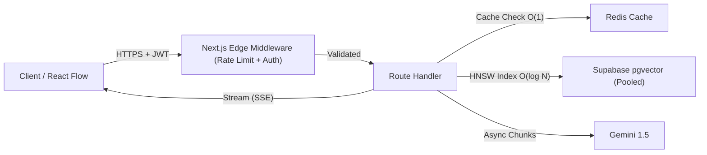

# AGENTARCHITECT ◈

> **Autonomous AI Software Architecture Studio & Engineering Command Center**  
> *Build the system before the code.*

[-black?style=flat-square&logo=next.js)](https://nextjs.org/)
[](https://react.dev/)
[-blue?style=flat-square&logo=typescript)](https://www.typescriptlang.org/)
[](https://langchain-ai.github.io/langgraphjs/)
[](https://ai.google.dev/)
[-336791?style=flat-square&logo=postgresql)](https://github.com/pgvector/pgvector)
[](https://reactflow.dev/)
[](https://tailwindcss.com/)
[](https://tailwindcss.com/)

---

## 1. Executive Summary

**AgentArchitect** (also known as **Sketch**) is a software architecture studio and developer command center. Instead of generating ungrounded, hallucinated code snippets from generic chatbots, AgentArchitect models complex software specifications step-by-step into verifiable system architectures, directed dependency graphs (DAG), failure blast radius simulations, and transparent Architecture Decision Records (ADRs).

```
┌─────────────────┐       ┌─────────────────┐       ┌─────────────────┐
│   PRDs / RFCs   │ ────► │ 10-Node Agent   │ ────► │ Interactive DAG │
│ Technical Brief │       │ Pipeline (LLM)  │       │ React Flow Map  │
└─────────────────┘       └─────────────────┘       └─────────────────┘
         │                         │                         │
         ▼                         ▼                         ▼
┌─────────────────┐       ┌─────────────────┐       ┌─────────────────┐
│ pgvector Corpus │       │ Zod Validation  │       │ Directed BFS    │
│ 768-dim RAG     │       │ Formal Schemas  │       │ Blast Radius    │
└─────────────────┘       └─────────────────┘       └─────────────────┘
```

---

## 2. Core Capabilities

### ◈ 1. Interactive Architecture Studio
- **React Flow Canvas**: Living directed acyclic graph (DAG) canvas powered by `@xyflow/react` over an infinite pitch-black workspace (`#000000`).
- **Dagre Auto-Layout**: One-click hierarchical topological layout (Left-to-Right `LR` or Top-to-Bottom `TB`).
- **Domain Node Primitives**: Specialized custom nodes for `Frontend`, `API Gateway`, `Backend Microservice`, `Database`, `In-Memory Cache`, `Message Queue`, and `Autonomous AI Agent`.
- **Component Toolbox Drawer**: Drag-and-drop palette grouped by *Application*, *Data & Storage*, *AI & Orchestration*, and *External Integrations*.
- **Deep Inspector Drawer**: Node configuration drawer with real-time parameter mutations, upstream/downstream dependency viewers, and inline blast radius simulation.

### ◉ 2. Autonomous Multi-Agent Pipeline (LangGraph.js)
Multi-step architecture synthesis with formal Zod schema boundaries at every transition:
1. `InputSanitizer`: Strips prompt injection, normalizes technical constraints, and structures domain vocabulary.
2. `RequirementAnalyzer`: Decomposes functional requirements and non-functional targets (throughput, latency, compliance).
3. `RAGRetriever`: Queries project RFCs and API specifications stored in `pgvector` using cosine similarity search.
4. `ArchitectDesigner`: Drafts modular microservice topologies and data flow communication protocols.
5. `ZodValidator`: Executes strict schema validation, ensuring valid node topologies and directed edges.
6. `SecurityAuditor`: Analyzes zero-trust perimeter, OAuth2/JWT token boundaries, and encryption in transit/rest.
7. `ScalabilityPlanner`: Evaluates stateless auto-scaling tiers, database sharding, and caching strategies.
8. `CostEstimator`: Approximates cloud infrastructure cost models based on IOPS and instance counts.
9. `GraphGenerator`: Computes coordinates, handles, and edge connection anchors.
10. `Synthesizer`: Outputs unified architecture JSON and streams real-time Server-Sent Events (SSE) telemetry.

### ⚡ 3. Directed Impact Analysis & Blast Radius Radar
- **Graph Breadth-First Search (BFS)**: Bidirectional traversal engine calculating upstream callers and downstream consumers.
- **Topological Cascade Visualizer**:
  - `● ROOT / ORIGIN (Distance = 0)`: Origin node of structural alteration or technology replacement.
  - `▲ DIRECT IMPACT (Distance = 1)`: Immediate callers, ORMs, and drivers requiring contract changes.
  - `○ INDIRECT CASCADE (Distance ≥ 2)`: Downstream ripple failures, data pipeline breakage, or schema desynchronization.
- **AI Mitigation Engine**: Generates zero-downtime transition playbooks (dual-schema write windows, circuit breakers, adapter layers).

### 📚 4. Document Knowledge Registry & pgvector RAG
- **5-Step Continuous Ingestion Pipeline**:
  `Upload ──► Text Normalization ──► Semantic Chunks (500 tokens / 50 overlap) ──► 768-dim Embeddings ──► pgvector Index`
- **Multi-Format Ingestion**: Supports `.pdf`, `.docx`, `.md`, `.txt`, and `.json`.
- **Grounded AI Architect Workbench**: Chat assistant with source chunk citations, architectural recommendations, and direct graph mutation proposals.

### 🌿 5. Immutable Version History & Side-by-Side Diff Engine
- **Git-Style Timeline**: Vertical commit history showing tagged architecture snapshots, author tags, and commit hashes.
- **Visual Architectural Diffing**:
  - `+ ADDED`: Newly provisioned nodes highlighted in green.
  - `~ MODIFIED`: Altered nodes showing before/after technology and protocol deltas in amber.
  - `- REMOVED`: Decommissioned components in red.
  - `= UNCHANGED`: Stable foundational nodes.
- **One-Click Restore**: Instant rollback of the active workspace canvas to any previous snapshot.

### ⚖️ 6. Architecture Decision Records (ADRs) & "Explain Simply" Mode
- **Transparent Rationale**: Every chosen technology or pattern includes architectural justification, evaluated alternatives, and trade-offs.
- **Dual Explanation Switch**: Single-click toggle between technical engineering specifications and plain-English executive summaries.

---

## 3. ChaiCode Design System

The application features the unified **ChaiCode** design system across every page (landing, authentication, dashboard, project catalog, visual canvas, and sub-views):

| Element | Token / Value | Description |
| :--- | :--- | :--- |
| **Canvas Base** | `#000000` | Pure pitch-black base canvas |
| **Card Surfaces** | `#111111` | Primary cards, panels, and modal containers |
| **Elevated Surfaces** | `#18181b` | Secondary sub-cards, drawers, and form inputs |
| **Primary Accent** | `#f97316` / `#ea580c` | Warm Chai Orange replacing legacy blues |
| **Ambient Glow** | `rgba(234, 88, 12, 0.15)` | Radial background spotlight glow (`blur-[120px]`) |
| **Hairline Borders** | `border-white/10` | Subtle translucent borders (`hover:border-white/20`) |
| **Typography** | `Manrope`, `font-sans` | Crisp geometric sans headings paired with `font-mono` metadata |
| **Primary Buttons** | `chai-btn-primary` | High-contrast orange CTA with signature diagonal corners (`0px 10px 0px 10px`) |
| **Footer** | 4-Column Layout | Comprehensive directory with inline SVG social icons |

---

## 4. Technology Stack

| Layer | Technology | Description |
| :--- | :--- | :--- |
| **Framework** | [Next.js 16 (App Router)](https://nextjs.org/) | Next.js with Turbopack compilation and React Server Components |
| **Runtime & UI** | [React 19](https://react.dev/) | React 19 streaming SSR and modern hooks |
| **Language** | [TypeScript 5](https://www.typescriptlang.org/) | Strict end-to-end type safety |
| **Styling** | [Tailwind CSS v4](https://tailwindcss.com/) | Modern utility engine with `@theme` design tokens |
| **Canvas Engine** | [@xyflow/react](https://reactflow.dev/) | High-performance interactive node-graph visualizer |
| **Graph Layout** | [Dagre](https://github.com/dagrejs/dagre) | Directed graph layout engine for automatic node positioning |
| **AI Multi-Agent** | [LangGraph.js](https://langchain-ai.github.io/langgraphjs/) | Stateful autonomous multi-actor workflow orchestration |
| **LLM & Embeddings**| [Google Gemini](https://ai.google.dev/) | `gemini-1.5-flash`, `gemini-1.5-pro`, and `text-embedding-004` |
| **Database & Vector**| [Supabase PostgreSQL + pgvector](https://supabase.com/) | 768-dimensional cosine vector search and transactional relational data |
| **Authentication** | [Clerk](https://clerk.com/) | Passwordless Email OTP & Secure Password authentication |
| **Client State** | [Zustand](https://zustand-demo.pmnd.rs/) | Lightweight reactive state stores for canvas, nodes, and edges |
| **Icons** | [Lucide React](https://lucide.dev/) | Clean, modern technical interface glyphs |

---

## 5. Security & Performance Architecture



- **Tenant Isolation & Zero-Trust**: All `/api/projects/[id]/*` endpoints enforce strict user ownership checks (`user.id === project.user_id`) to eliminate Insecure Direct Object References (IDOR).
- **HNSW Vector Indexing**: `pgvector` embeddings use Hierarchical Navigable Small World (HNSW) indexing, converting linear vector table scans ($O(N \cdot D)$) into sub-linear logarithmic lookups ($O(\log N)$).
- **Relational Composite Indexing**: High-cardinality foreign keys (`project_id`, `created_at`) are indexed with B-Trees for $O(1)$ canvas loading.
- **Server-Sent Events (SSE) Streaming**: Long-running agent reasoning and RAG chat stream intermediate tokens over `ReadableStream`, preventing serverless gateway timeouts (504s).
- **Connection Resilience**: Database access is routed through the Supabase Transaction Pooler (PgBouncer on port `6543`) to prevent connection pool exhaustion under serverless scale.

---

## 6. Repository Structure

```
D:/Sketch/
├── src/
│   ├── app/
│   │   ├── api/
│   │   │   └── projects/
│   │   │       ├── [id]/
│   │   │       │   ├── architecture/          # Graph CRUD & LangGraph generation
│   │   │       │   ├── chat/                  # RAG AI assistant endpoint (SSE stream)
│   │   │       │   ├── documents/             # Multi-format upload & parsing
│   │   │       │   ├── impact-analysis/       # BFS blast radius calculation
│   │   │       │   └── versions/              # Snapshot commit & rollback
│   │   │       └── route.ts                   # Projects collection API
│   │   ├── dashboard/                         # Command Center & Registry overview
│   │   ├── docs/                              # System documentation & manual
│   │   ├── forgot-password/                   # Password recovery flow
│   │   ├── login/ & signup/                   # Clerk OTP & Password authentication
│   │   ├── projects/                          # Architecture catalog & details
│   │   ├── settings/                          # User profile & architecture preferences
│   │   ├── tech-stack/[id]/                   # Technology selection & explanation mode
│   │   ├── workspace/[id]/                    # React Flow studio & visual DAG canvas
│   │   │   └── decisions/                     # Architecture Decision Records (ADR)
│   │   ├── globals.css                        # Tailwind v4 theme, ChaiCode tokens, animations
│   │   ├── layout.tsx                         # Root layout with ClerkProvider, Navbar & Footer
│   │   └── page.tsx                           # Command Center product launch landing page
│   ├── components/
│   │   ├── home/                              # LivingTopologyGraph hero animation
│   │   ├── layout/                            # Navbar, ChaiCode Footer, Brand glyph
│   │   └── ui/                                # Primitives (Button, Card, Input, Tabs, Dialog)
│   ├── features/
│   │   ├── agents/                            # LangGraph state visualizer & telemetry
│   │   ├── architecture/                      # Canvas, CustomNode, Toolbox, Inspector, Store
│   │   ├── documents/                         # Knowledge base manager & 5-step RAG pipeline
│   │   ├── impact-analysis/                   # Blast radius visual tree & mitigation strategy
│   │   ├── projects/                          # 4-step creation wizard & project cards
│   │   ├── rag/                               # AI Architect chat workbench
│   │   └── versions/                          # Git-style vertical timeline & side-by-side diff
│   ├── lib/
│   │   ├── gemini/                            # Gemini model client & embeddings
│   │   ├── supabase/                          # Admin client, server client & pgvector operations
│   │   └── utils/                             # Dagre auto-layout & formatters
│   ├── services/                              # ArchitectureService, DocumentService, ImpactService...
│   └── types/                                 # Strict TypeScript database & graph schemas
├── public/                                    # Static assets & brand vectors
├── .env.example                               # Environment variable documentation
├── next.config.ts                             # Next.js configuration
├── package.json                               # Dependencies & scripts
└── tsconfig.json                              # TypeScript strict configuration
```

---

## 7. Getting Started

### Prerequisites
- **Node.js**: `v20.x` or higher
- **Package Manager**: `npm`, `pnpm`, or `yarn`
- **PostgreSQL**: With `pgvector` extension enabled (e.g. via Supabase)
- **Google AI Studio**: Gemini API key
- **Clerk**: Authentication project keys

### Installation & Local Setup

1. **Clone the repository**:
   ```bash
   git clone https://github.com/your-org/agentarchitect.git
   cd agentarchitect
   ```

2. **Install dependencies**:
   ```bash
   npm install
   ```

3. **Configure Environment Variables**:
   Create a `.env.local` file in the root directory:
   ```env
   # Clerk Authentication
   NEXT_PUBLIC_CLERK_PUBLISHABLE_KEY=pk_test_...
   CLERK_SECRET_KEY=sk_test_...

   # Google Gemini AI
   GOOGLE_GENERATIVE_AI_API_KEY=AIzaSy...

   # PostgreSQL / Supabase with pgvector
   NEXT_PUBLIC_SUPABASE_URL=https://your-project.supabase.co
   NEXT_PUBLIC_SUPABASE_ANON_KEY=eyJhbGci...
   SUPABASE_SERVICE_ROLE_KEY=eyJhbGci...
   ```

4. **Verify TypeScript Compilation**:
   ```bash
   npx tsc --noEmit
   ```

5. **Build for Production**:
   ```bash
   npm run build
   ```

6. **Start the Development Server**:
   ```bash
   npm run dev
   ```
   Open [http://localhost:3000](http://localhost:3000) in your browser.

---

## 8. API Surface

| Route | Method | Description |
| :--- | :---: | :--- |
| `/api/projects` | `GET` | List all projects for authenticated user |
| `/api/projects` | `POST` | Initialize new architecture briefing specification |
| `/api/projects/[id]` | `GET` | Retrieve complete project metadata and requirements |
| `/api/projects/[id]` | `DELETE` | Permanently decommission project and all embeddings |
| `/api/projects/[id]/architecture` | `GET` | Fetch active components and directed dependency links |
| `/api/projects/[id]/architecture` | `PUT` | Persist modified graph topology from React Flow canvas |
| `/api/projects/[id]/architecture/generate` | `POST` | Execute multi-agent autonomous synthesis (SSE stream) |
| `/api/projects/[id]/documents` | `GET` | List ingested specifications and vector status |
| `/api/projects/[id]/documents` | `POST` | Upload and chunk PDF/DOCX/MD into 768-dim pgvector store |
| `/api/projects/[id]/documents/[docId]` | `DELETE` | Remove document and purge vector embeddings |
| `/api/projects/[id]/impact-analysis` | `POST` | Execute BFS graph traversal to calculate blast radius |
| `/api/projects/[id]/chat` | `POST` | Context-grounded RAG query against project corpus (SSE stream) |
| `/api/projects/[id]/versions` | `GET` | Fetch immutable snapshot history |
| `/api/projects/[id]/versions` | `POST` | Tag manual architecture release checkpoint |
| `/api/projects/[id]/versions/[versionId]/restore`| `POST` | Restore studio canvas to snapshot |

---

## 9. Contributing & License

Contributions are welcome from system architects, distributed systems engineers, and AI practitioners.

1. Fork the repository
2. Create a feature branch (`git checkout -b feature/distributed-tracing-node`)
3. Commit your changes (`git commit -m 'feat: add distributed tracing node primitive'`)
4. Ensure `npx tsc --noEmit` and `npm run build` pass cleanly
5. Push to the branch (`git push origin feature/distributed-tracing-node`)
6. Open a Pull Request

Distributed under the **MIT License**. See `LICENSE` for more information.
