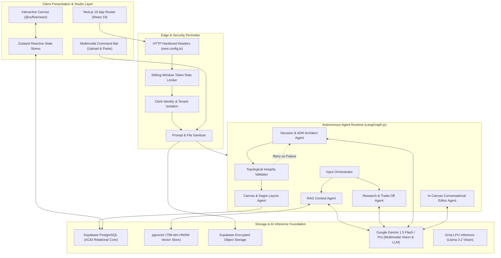
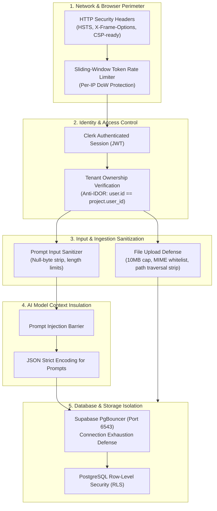

# Sketch ◈


> **Autonomous AI Software Architecture Studio & Engineering Command Center**  
> *Build the system before the code.*

[-black?style=flat-square&logo=next.js)](https://nextjs.org/)
[](https://react.dev/)
[-blue?style=flat-square&logo=typescript)](https://www.typescriptlang.org/)
[](https://langchain-ai.github.io/langgraphjs/)
[](https://ai.google.dev/)
[-336791?style=flat-square&logo=postgresql)](https://github.com/pgvector/pgvector)
[](https://reactflow.dev/)
[](https://tailwindcss.com/)
[](https://tailwindcss.com/)

---

## 1. Executive Summary

**Sketch** is an autonomous software architecture studio and engineering command center designed to solve a fundamental flaw in modern AI engineering: **the premature generation of ungrounded, hallucinated code**.

Building complex distributed systems without architectural validation leads to broken integration boundaries, security vulnerabilities, single points of failure, and spiraling tech debt. Sketch flips this paradigm by modeling software specifications step-by-step into verifiable system architectures, directed dependency graphs (DAG), failure blast radius simulations, and transparent Architecture Decision Records (ADRs).

```
┌─────────────────────────────────┐       ┌─────────────────────────────────┐       ┌─────────────────────────────────┐
│       Multimodal Ingestion      │ ────► │     Autonomous Multi-Agent      │ ────► │    Interactive Living Studio    │
│  PRDs, RFCs, Whiteboard Vision  │       │   LangGraph.js Orchestration    │       │     @xyflow/react DAG Canvas    │
└─────────────────────────────────┘       └─────────────────────────────────┘       └─────────────────────────────────┘
                 │                                         │                                         │
                 ▼                                         ▼                                         ▼
┌─────────────────────────────────┐       ┌─────────────────────────────────┐       ┌─────────────────────────────────┐
│     PostgreSQL + pgvector       │       │    Topological Validation &     │       │     Directed Blast Radius       │
│    768-dim Semantic Knowledge   │       │     Self-Healing Feedback       │       │    BFS Cascade Impact Radar     │
└─────────────────────────────────┘       └─────────────────────────────────┘       └─────────────────────────────────┘
```

---

## 2. Website Architecture & End-to-End Workflow

Sketch is designed as a unified full-stack reactive system where client-side canvas manipulation seamlessly interacts with autonomous multi-agent backend runtimes and vector knowledge stores.

### 2.1 System Architecture Overview



---

### 2.2 Complete User Journey & Website Workflow

The user experience in Sketch flows across distinct phases:

1. **Identity & Onboarding**:
   - Secure authentication via [Clerk](https://clerk.com/) supporting Passwordless Email OTP and OAuth.
   - Upon authentication, users enter the unified **Command Center Dashboard** containing their architecture catalog, recent activity, system telemetry, and architectural blueprints.

2. **Project Initiation & Multimodal Ingestion**:
   - Users create a project by describing their software vision or system problem in natural language.
   - **Dual Specification Ingestion**:
     - *Technical Documents*: Upload `.pdf`, `.docx`, `.md`, `.txt`, or `.json` containing requirements, RFCs, and API specifications.
     - *Architecture Blueprint & Diagram Vision*: Drag-and-drop or paste (`Ctrl+V`) whiteboard photos, system diagrams, or mockups (`.png`, `.jpg`, `.webp`, `.svg`).
   - The ingestion pipeline extracts visual entities and converts text into 500-token semantic chunks, embedded into a 768-dimensional vector space using `text-embedding-004` and stored in `pgvector`.

3. **Autonomous Architecture Generation**:
   - The user triggers system synthesis.
   - The **LangGraph.js Multi-Agent Pipeline** initializes, analyzing requirements, cross-referencing vector embeddings, comparing trade-offs, and constructing a validated component topology.
   - Real-time telemetry streams the status of each agent directly to the user interface.

4. **Visual Studio & Interactive Canvas Exploration**:
   - The compiled architecture renders on the `@xyflow/react` infinite canvas.
   - High-contrast custom node primitives represent each architectural tier (`Frontend`, `API Gateway`, `Backend Microservice`, `Database`, `In-Memory Cache`, `Message Queue`, and `Autonomous AI Agent`).
   - **Component Toolbox**: A slide-out drawer allowing architects to drag and drop custom architectural primitives onto the canvas.
   - **Deep Node Inspector**: Clicking any component reveals real-time configuration, assigned responsibilities, upstream callers, downstream consumers, and inline blast radius simulation.
   - **Dagre Auto-Layout**: One-click re-indexing of nodes into clean hierarchical topological structures (Left-to-Right `LR` or Top-to-Bottom `TB`).

5. **In-Canvas Conversational AI Architecture Editing**:
   - Through the natural language command interface, architects can type commands such as:
     > *"Add a Redis cache between the backend service and the primary database to handle hot read queries"*
     > *"Introduce Kafka between order processing and notifications for asynchronous decoupling"*
   - The [`runAIEditorAgent`](file:///D:/Sketch/src/agents/editing/aiEditorAgent.ts) parses the existing graph, determines additions, mutations, or deletions, evaluates risk level (`low`, `medium`, `high`), and applies the changes directly to the live canvas.

6. **Directed Blast Radius & Impact Analysis**:
   - When any component technology or contract is altered, the user can run a **Blast Radius Radar**.
   - An asynchronous graph Breadth-First Search (BFS) traverses the directed dependency graph, isolating:
     - `● ROOT / ORIGIN (Distance = 0)`: The origin component under modification.
     - `▲ DIRECT IMPACT (Distance = 1)`: Immediate callers, ORMs, and drivers requiring contract adaptations.
     - `○ INDIRECT CASCADE (Distance ≥ 2)`: Downstream consumers, asynchronous pipelines, or reporting jobs.
   - An AI mitigation planner generates zero-downtime transition playbooks (dual-schema write windows, circuit breakers, fallback adapters).

7. **Architecture Decision Records (ADRs) & "Explain Simply" Mode**:
   - Every architectural choice is recorded in a formal ADR outlining the context, chosen technology, alternatives considered, and trade-offs.
   - **Executive Toggle**: An instant switch transforms dense engineering jargon into plain-English summaries suitable for non-technical stakeholders.

8. **Immutable Version Control & Architectural Diff Engine**:
   - Every modification creates a tagged, immutable snapshot in Supabase.
   - **Side-by-Side Visual Diffing**: Color-coded deltas highlight Added (`+ green`), Modified (`~ amber`), Removed (`- red`), and Unchanged (`= gray`) nodes.
   - **One-Click Restore**: Instant rollbacks to any historical commit point.

---

## 3. Autonomous Multi-Agent Workflow (LangGraph.js)

The core intelligence of Sketch is powered by a stateful, cyclic multi-agent graph built on [`@langchain/langgraph`](https://langchain-ai.github.io/langgraphjs/), located in [`src/lib/langgraph/workflow.ts`](file:///D:/Sketch/src/lib/langgraph/workflow.ts).

Rather than relying on a single monolithic prompt, Sketch distributes cognitive responsibilities across specialized agent nodes with formal state transitions, conditional branching, and a self-healing validation loop.

### 3.1 LangGraph State Machine Architecture

```mermaid
flowchart TD
    START([START]) --> Orchestrator["1. Input Orchestrator\n(Sanitize, Route, Contextualize)"]
    
    Orchestrator --> HasDocsCondition{"Documents\nUploaded?"}
    
    HasDocsCondition -- "YES" --> RAGAgent["2. RAG Agent\n(768-dim pgvector Retrieval)"]
    HasDocsCondition -- "NO" --> ResearchAgent["3. Research Agent\n(First-Principles Architecture Research)"]
    
    RAGAgent --> ResearchAgent
    
    ResearchAgent --> DecisionAgent["4. Decision Agent\n(Topology, Layers, Technology & ADRs)"]
    
    DecisionAgent --> ValidationStep["5. Validation Step\n(Topological Sanity & Contract Checks)"]
    
    ValidationStep --> IsValidCondition{"Topology\nValid?"}
    
    IsValidCondition -- "NO (Retries < 2)" --> DecisionAgentFeedback["Decision Agent\n(Self-Healing Loop with Feedback)"]
    DecisionAgentFeedback --> ValidationStep
    
    IsValidCondition -- "YES or Max Retries" --> CanvasAgent["6. Canvas Agent\n(Dagre Hierarchical Graph Layout)"]
    
    CanvasAgent --> SaveProject["7. Save Project Node\n(Persist Graph, Components & Version Snapshot)"]
    
    SaveProject --> END([END])
    
    style START fill:#18181b,stroke:#f97316,stroke-width:2px
    style END fill:#18181b,stroke:#10b981,stroke-width:2px
    style Orchestrator fill:#111111,stroke:#f97316,stroke-width:1px
    style RAGAgent fill:#111111,stroke:#38bdf8,stroke-width:1px
    style ResearchAgent fill:#111111,stroke:#a855f7,stroke-width:1px
    style DecisionAgent fill:#111111,stroke:#eab308,stroke-width:1px
    style DecisionAgentFeedback fill:#18181b,stroke:#ef4444,stroke-width:1px
    style ValidationStep fill:#111111,stroke:#f43f5e,stroke-width:1px
    style CanvasAgent fill:#111111,stroke:#06b6d4,stroke-width:1px
    style SaveProject fill:#111111,stroke:#10b981,stroke-width:1px
```



---

### 3.2 Deep Dive into Agent Roles

#### 1. Input Orchestrator Agent
* **Implementation**: [`runInputOrchestrator`](file:///D:/Sketch/src/agents/orchestrator/inputOrchestrator.ts)
* **Responsibility**: Sanitizes the raw user prompt, normalizes technical constraints, and assesses whether the project contains uploaded RFC documents or visual diagrams.
* **Routing Logic**:
  - If documents exist: Routes dynamically to `RAG_AGENT`.
  - If no documents exist: Bypasses vector retrieval and routes directly to `RESEARCH_AGENT`.

#### 2. RAG (Retrieval-Augmented Generation) Agent
* **Implementation**: [`runRagAgent`](file:///D:/Sketch/src/agents/rag/ragAgent.ts)
* **Responsibility**: Queries the project's vector corpus in `pgvector` using cosine similarity match functions (`match_document_chunks`).
* **Output ([`RagProjectContext`](file:///D:/Sketch/src/agents/types.ts#L16-L24))**: Extracted target user personas, core functional requirements, technical constraints, identified legacy technologies, and compliance boundaries.

#### 3. Research Agent
* **Implementation**: [`runResearchAgent`](file:///D:/Sketch/src/agents/research/researchAgent.ts)
* **Responsibility**: Acts as a principal cloud architect conducting first-principles technical evaluation based on user preferences (budget, security, scalability, performance).
* **Output ([`ResearchFindings`](file:///D:/Sketch/src/agents/types.ts#L36-L56))**:
  - Assesses system complexity (`low`, `medium`, `high`, `enterprise`).
  - Evaluates technology options across all tiers (Frontend, Backend, Database, AI Orchestration, In-Memory Storage, Event Streaming).
  - Selects the recommended tech stack with detailed pros/cons and trade-off matrices.
  - Formulates key architectural patterns (e.g. CQRS, Event-Driven, Micro-frontends, Hexagonal Architecture).

#### 4. Decision Agent
* **Implementation**: [`runDecisionAgent`](file:///D:/Sketch/src/agents/decision/decisionAgent.ts)
* **Responsibility**: Synthesizes the concrete system specification from the research findings.
* **Output ([`ArchitectureSpecification`](file:///D:/Sketch/src/agents/types.ts#L98-L110))**:
  - Architectural layers (`client`, `application`, `ai`, `data`, `infra`).
  - Explicit component entities with categories, technologies, and assigned micro-responsibilities.
  - Directed connection edges with communication protocols (`sync`, `async`, `auth`, `data_stream`).
  - Formal Architecture Decision Records (ADRs) with both technical reasoning and executive "simple" explanations.

#### 5. Validation Step (Self-Healing Loop)
* **Implementation**: [`runValidationStep`](file:///D:/Sketch/src/agents/validation/validationStep.ts)
* **Responsibility**: Programmatic topological integrity validation that verifies graph correctness before rendering:
  - **Tier Sanity**: Verifies that frontend layers do not bypass application tiers to connect directly to private databases.
  - **Orphan Detection**: Ensures every component has at least one ingress or egress connection.
  - **Cycle & Dependency Checks**: Flags invalid circular dependencies or unresolvable contracts.
* **Self-Healing Feedback Loop**:
  - If validation fails (`isValid: false`) and retries < 2, the graph routes back to the **Decision Agent** with structured feedback (`missingComponents`, `brokenRelationships`).
  - The Decision Agent ingests the feedback and regenerates a repaired specification.

#### 6. Canvas Agent
* **Implementation**: [`runCanvasAgent`](file:///D:/Sketch/src/agents/canvas/canvasAgent.ts)
* **Responsibility**: Converts the abstract architectural specification into a visual graph structure compatible with `@xyflow/react`.
* **Execution**: Utilizes the **Dagre** layout engine to compute 2D positions (`x`, `y`), handle anchor points, and edge routing, ensuring optimal visual spacing and eliminating node collisions.

#### 7. Save Project Node
* **Implementation**: [`ArchitectureService.saveGeneratedArchitecture`](file:///D:/Sketch/src/services/architectureService.ts)
* **Responsibility**: Persists the generated graph nodes, components, and dependencies into PostgreSQL tables within a transactional unit and records a new version checkpoint in `project_versions`.

#### 8. In-Canvas Conversational AI Editor Agent
* **Implementation**: [`runAIEditorAgent`](file:///D:/Sketch/src/agents/editing/aiEditorAgent.ts)
* **Responsibility**: Operates on an active workspace canvas. When a user issues natural language modification commands, it calculates graph mutations (adds, edits, removals, new connections) and provides a blast radius risk rating before updating the live canvas.

---

## 4. Security Architecture & Hardening Controls

Sketch implements defense-in-depth security principles across application, network, data, and AI inference layers, detailed in [`SECURITY.md`](SECURITY.md).



### 4.1 Detailed Security Hardening Breakdown

| Security Dimension | Vulnerability Addressed | Implementation & Defense Mechanism | Source Files |
| :--- | :--- | :--- | :--- |
| **HTTP Security Headers** | Clickjacking, MIME-sniffing, XSS, protocol downgrade | Enforces browser protections: `X-Frame-Options: DENY`, `X-Content-Type-Options: nosniff`, `Referrer-Policy: strict-origin-when-cross-origin`, `Strict-Transport-Security: max-age=31536000`, `Permissions-Policy`. | [`next.config.ts`](file:///D:/Sketch/next.config.ts) |
| **Denial-of-Wallet (DoW) & Rate Limiting** | AI API quota exhaustion, denial-of-service, multi-agent execution spam | In-memory sliding-window token rate limiting per client IP with automatic garbage collection to prevent memory leaks. | [`rateLimiter.ts`](file:///D:/Sketch/src/lib/security/rateLimiter.ts), [`index.ts`](file:///D:/Sketch/src/lib/security/index.ts) |
| **Prompt Injection & Model Jailbreaks** | Indirect prompt injection via malicious uploaded documents or hijacked prompts | User queries are capped and sanitized. Retrieved vector chunks are encapsulated in strict `<untrusted_retrieved_context>` XML tags with explicit system directives instructing the model to treat content as reference data rather than instructions. | [`aiEditorAgent.ts`](file:///D:/Sketch/src/agents/editing/aiEditorAgent.ts), [`sanitizer.ts`](file:///D:/Sketch/src/lib/security/sanitizer.ts) |
| **File Upload & Storage Traversal** | Remote code execution, arbitrary file writes, server memory exhaustion | Strict 10MB file barrier. Whitelist for specs (`.pdf`, `.docx`, `.txt`, `.md`, `.json`) and diagrams (`.png`, `.jpg`, `.jpeg`, `.webp`, `.svg`, `.gif`). Filenames are stripped of null bytes, control codes, and directory traversal sequences (`../`). | [`sanitizer.ts`](file:///D:/Sketch/src/lib/security/sanitizer.ts), [`documentService.ts`](file:///D:/Sketch/src/services/documentService.ts) |
| **Open Redirect Defense** | Phishing attacks via manipulated post-auth redirect targets | The post-authentication callback strictly verifies relative target paths (`/`), rejecting any target beginning with `//` or specifying external protocols (`https://`). | [`callback/route.ts`](file:///D:/Sketch/src/app/auth/callback/route.ts) |
| **Tenant Isolation & Anti-IDOR** | Unauthorized cross-tenant data access or modification | Project operations strictly enforce authenticated user ownership checks (`user.id === project.user_id`), preventing Insecure Direct Object Reference vulnerabilities. | [`projectService.ts`](file:///D:/Sketch/src/services/projectService.ts), [`architectureService.ts`](file:///D:/Sketch/src/services/architectureService.ts) |
| **Database Connection Resilience** | Serverless connection spikes exhausting PostgreSQL connections | All database traffic routes through Supabase's transaction pooler (PgBouncer on port `6543`), ensuring connection stability under high traffic. | [`server.ts`](file:///D:/Sketch/src/lib/supabase/server.ts), [`admin.ts`](file:///D:/Sketch/src/lib/supabase/admin.ts) |

---

## 5. Technology Stack & Architectural Rationale

Every technology in the Sketch stack was chosen to solve specific distributed systems, visualization, or AI orchestration challenges:

```
┌───────────────────────────────────────────────────────────────────────────────────────────────────────┐
│                                          SKETCH TECH STACK                                            │
├───────────────────┬───────────────────────────────────┬───────────────────────────────────────────────┤
│ Layer             │ Technology                        │ Primary Architectural Rationale               │
├───────────────────┼───────────────────────────────────┼───────────────────────────────────────────────┤
│ Application Frame │ Next.js 16 (App Router + Turbo)   │ Turbopack compilation & Server Components     │
│ Frontend Runtime  │ React 19                          │ Streaming SSR & concurrent render primitives  │
│ Language          │ TypeScript 5 (Strict)             │ End-to-end type safety across agent state     │
│ Styling & Tokens  │ Tailwind CSS v4 + ChaiCode        │ Ultra-fast zero-runtime modern CSS tokens     │
│ Interactive Canvas│ @xyflow/react (React Flow 12)     │ Declarative, performant node-graph visualizer │
│ Auto-Layout Engine│ Dagre                             │ Deterministic hierarchical DAG positioning    │
│ Agent Runtime     │ LangGraph.js                      │ Stateful cyclic graphs & self-healing loops   │
│ AI Inference      │ Google Gemini 1.5 & Groq          │ Large context, native vision & fast inference │
│ Database & Vector │ Supabase PostgreSQL + pgvector    │ ACID relational models + unified 768-dim RAG  │
│ Authentication    │ Clerk                             │ Turnkey identity, OTP, and session management │
│ Client State Store│ Zustand                           │ Boilerplate-free, fast canvas mutation store  │
│ Document Parsing  │ Mammoth & PDF-Parse               │ Headless server-side text extraction          │
└───────────────────┴───────────────────────────────────┴───────────────────────────────────────────────┘
```

### 5.1 Why Each Technology Was Chosen

#### 1. Next.js 16 (App Router) & React 19
* **Why Next.js 16?** Provides a unified full-stack architecture. Server Components stream static parts of the application instantly while Turbopack delivers near-instantaneous compilation during development. The App Router provides seamless integration for Edge middleware, server actions, and Server-Sent Events (SSE).
* **Why React 19?** React 19 introduces optimized concurrent rendering and modern hook primitives, essential for keeping an infinite `@xyflow/react` canvas responsive even when rendering dozens of complex custom nodes and animations.

#### 2. TypeScript 5 (Strict Mode)
* **Why TypeScript?** Designing software architectures requires rigorous data contracts. TypeScript enforces compile-time schema integrity across multi-agent state definitions, graph topologies, database entities, and BFS algorithms, preventing catastrophic runtime type errors.

#### 3. LangGraph.js (`@langchain/langgraph`)
* **Why LangGraph.js instead of traditional LLM chains?** Traditional agent frameworks execute linear sequences (A → B → C). Real-world architectural synthesis requires **cyclic graphs, conditional branching, and checkpointed state**. LangGraph.js enables:
  - Conditional branching based on whether documents exist.
  - A self-healing validation loop where the `ValidationStep` can route failures back to the `DecisionAgent` with diagnostic feedback.
  - Granular telemetry streaming at every node boundary.

#### 4. Google Gemini 1.5 (Flash / Pro) & Groq Vision
* **Why Gemini 1.5?**
  - **Massive Context Window**: Allows ingesting entire multi-page system PRDs, RFCs, and API documentation in a single pass without losing context.
  - **Native Multimodal Vision**: Enables Sketch to understand whiteboard drawings, architecture diagram screenshots, and system sketches directly.
  - **High Token Velocity**: Gemini 1.5 Flash provides sub-second reasoning turns for interactive workflows.
* **Why Groq?** Provides ultra-low latency LPU inference when running fast vision and real-time interactive generation turns.

#### 5. Supabase PostgreSQL with `pgvector`
* **Why Supabase + pgvector instead of a standalone vector database?**
  - Storing relational models (projects, components, dependencies, versions) in PostgreSQL while storing vector embeddings in a separate external vector database (like Pinecone) causes data desynchronization, dual-write complexities, and doubled infrastructure cost.
  - `pgvector` allows transactional consistency: vector chunks and relational entities live in the exact same ACID database.
  - **HNSW Indexing**: Delivers sub-linear $O(\log N)$ approximate nearest neighbor cosine similarity search across 768-dimensional embeddings.

#### 6. `@xyflow/react` (React Flow) & Dagre
* **Why `@xyflow/react`?** It is the gold standard for web-based node diagrams, offering infinite canvas virtualization, smooth zoom/pan controls, custom node component templates, and drag-and-drop handles.
* **Why Dagre?** Hand-placing dozens of architectural components is tedious and messy. Dagre computes optimal hierarchical layout mathematics automatically (rankdir: `LR` or `TB`), ensuring clean edge pathways with minimal crossing.

#### 7. Clerk Authentication
* **Why Clerk?** Providing enterprise-grade security requires passwordless OTP, OAuth providers, session rotation, and multi-factor authentication. Clerk offloads security maintenance while integrating cleanly with Next.js App Router middleware.

#### 8. Zustand
* **Why Zustand instead of Redux or React Context?**
  - Visual canvases generate hundreds of high-frequency events (node dragging, panning, selection, edge connection).
  - React Context triggers re-renders across the entire component tree on every minor coordinate shift.
  - Zustand provides targeted selector subscriptions, updating only the specific node that moved without re-rendering the canvas.
  - Zero boilerplate with intuitive mutable store setters.

#### 9. Tailwind CSS v4 & ChaiCode Design System
* **Why Tailwind v4?** Next-generation CSS engine that eliminates JavaScript-based build steps. It supports `@theme` design tokens natively, powering the bespoke **ChaiCode** design system featuring pitch-black canvases (`#000000`), warm Chai Orange accents (`#f97316`), and subtle translucent hairline borders (`border-white/10`).

#### 10. Mammoth & PDF-Parse
* **Why Mammoth & PDF-Parse?** Enables fast, lightweight server-side text extraction from Word documents (`.docx`) and PDFs (`.pdf`) without needing resource-heavy headless browsers or external SaaS parsing APIs.

---

## 6. Interactive Features & Capabilities

### ◈ Living Architecture Canvas
* Infinite dark canvas with customizable grid patterns.
* 7 domain-specific custom node types with status indicators, technology tags, and connection ports.
* Real-time drag-and-drop component palette.

### ⚡ Directed Blast Radius & Impact Radar
* Graph Breadth-First Search (BFS) calculation.
* Categorizes changes into Root (Distance = 0), Direct Callers (Distance = 1), and Indirect Ripple (Distance ≥ 2).
* Automated mitigation strategies for zero-downtime component transitions.

### 📸 Multimodal Document & Vision Ingestion
* Simultaneous support for technical specifications and visual architecture blueprints.
* Direct clipboard screenshot paste (`Ctrl+V`) into the command interface.
* Semantic chunking (500 tokens / 50 token overlap) with 768-dim embeddings in `pgvector`.

### 🌿 Git-Style Snapshot History & Diff Engine
* Commit timeline tracking architectural evolutions.
* Visual side-by-side diff engine highlighting added, modified, and removed components.
* One-click rollback to any historical system state.

### ⚖️ Architecture Decision Records (ADRs)
* Standardized decision documentation with context, chosen pattern, alternatives, and trade-offs.
* "Explain Simply" toggle converting technical specifications into executive-friendly summaries.

---

## 7. ChaiCode Design System

The application features the unified **ChaiCode** design system across all views:

| Design Token | Value | Applied Context |
| :--- | :--- | :--- |
| **Canvas Base** | `#000000` | Pure pitch-black studio base |
| **Card Surface** | `#111111` | Primary cards, panels, and modal containers |
| **Elevated Surface** | `#18181b` | Secondary sub-cards, drawers, and form inputs |
| **Primary Accent** | `#f97316` / `#ea580c` | Warm Chai Orange signature brand color |
| **Ambient Glow** | `rgba(234, 88, 12, 0.15)` | Radial background spotlight glow (`blur-[120px]`) |
| **Hairline Border** | `border-white/10` | Translucent border (`hover:border-white/20`) |
| **Typography** | `Manrope`, `font-sans` | Geometric sans headings paired with `font-mono` metrics |
| **Primary Buttons** | `chai-btn-primary` | High-contrast orange CTA with signature diagonal corners (`0px 10px 0px 10px`) |

---

## 8. Repository Structure

```
D:/Sketch/
├── src/
│   ├── agents/                                # Multi-agent implementation
│   │   ├── canvas/                            # CanvasAgent (Dagre layout calculation)
│   │   ├── decision/                          # DecisionAgent (ADRs & system layers)
│   │   ├── editing/                           # AIEditorAgent (In-canvas conversational editing)
│   │   ├── orchestrator/                      # InputOrchestrator (Route & input parsing)
│   │   ├── rag/                               # RagAgent (pgvector context retrieval)
│   │   ├── research/                          # ResearchAgent (Trade-off & stack analysis)
│   │   ├── validation/                        # ValidationStep (Topological self-healing)
│   │   └── types.ts                           # Agent domain types and state interfaces
│   ├── app/                                   # Next.js App Router pages and layouts
│   │   ├── dashboard/                         # Project Command Center
│   │   ├── docs/                              # System documentation
│   │   ├── login/ & signup/                   # Clerk authentication views
│   │   ├── projects/                          # Architecture catalog
│   │   ├── tech-stack/[id]/                   # Technology selection & comparison view
│   │   ├── workspace/[id]/                    # Interactive React Flow studio canvas
│   │   │   └── decisions/                     # Architecture Decision Records (ADRs)
│   │   ├── globals.css                        # Tailwind v4 theme & ChaiCode design tokens
│   │   └── page.tsx                           # Landing page & living hero topology
│   ├── components/                            # Reusable React components
│   │   ├── home/                              # LivingTopologyGraph hero canvas
│   │   ├── layout/                            # Navbar, ChaiCode Footer, Brand glyph
│   │   └── ui/                                # Tactile primitives (Button, Card, Input, Tabs)
│   ├── features/                              # Domain-specific UI features
│   │   ├── agents/                            # Multi-agent visual telemetry
│   │   ├── architecture/                      # Studio canvas, custom nodes, inspector, drawer
│   │   ├── documents/                         # Document upload, chunking & vector registry
│   │   ├── impact-analysis/                   # Blast radius tree & mitigation viewer
│   │   ├── projects/                          # Creation wizards & project cards
│   │   ├── rag/                               # Grounded AI architect chat workbench
│   │   └── versions/                          # Git-style timeline & visual diff viewer
│   ├── lib/                                   # Shared core utilities
│   │   ├── gemini/                            # Google Gemini client & embeddings
│   │   ├── langgraph/                         # StateGraph definitions & workflow runner
│   │   ├── logger/                            # Structured agent telemetry logger
│   │   ├── security/                          # Rate limiter, sanitizer, input guards
│   │   ├── supabase/                          # Database clients & SSR cookies
│   │   └── utils/                             # Dagre auto-layout & class merging
│   ├── services/                              # Business service layer
│   │   ├── architectureService.ts             # Graph CRUD, persistence & snapshots
│   │   ├── chunkingService.ts                 # 500-token semantic chunking
│   │   ├── documentParser.ts                  # PDF/DOCX extraction & multimodal vision
│   │   ├── documentService.ts                 # Storage upload & vector persistence
│   │   ├── embeddingService.ts                # 768-dim embedding generation
│   │   ├── impactAnalysisService.ts           # Directed BFS blast radius engine
│   │   ├── projectService.ts                  # Project lifecycle management
│   │   └── ragService.ts                      # Vector cosine similarity search
│   └── types/                                 # TypeScript database & graph schemas
├── supabase/
│   └── schema.sql                             # Database schema & pgvector definitions
├── .env.example                               # Environment variable blueprint
├── next.config.ts                             # Next.js security headers & compilation
├── package.json                               # Dependencies & scripts
├── SECURITY.md                                # In-depth security architecture audit
└── tsconfig.json                              # TypeScript strict configuration
```

---

## 9. Getting Started

### Prerequisites
* **Node.js**: `v20.x` or higher
* **Package Manager**: `npm`, `pnpm`, or `yarn`
* **PostgreSQL**: With `pgvector` extension enabled (e.g. Supabase)
* **Google AI Studio**: Gemini API key
* **Clerk**: Authentication project keys

### Local Setup

1. **Clone the repository**:
   ```bash
   git clone https://github.com/your-org/sketch.git
   cd sketch
   ```

2. **Install dependencies**:
   ```bash
   npm install
   ```

3. **Configure Environment Variables**:
   Create a `.env.local` file in the root directory:
   ```env
   # Clerk Authentication
   NEXT_PUBLIC_CLERK_PUBLISHABLE_KEY=pk_test_...
   CLERK_SECRET_KEY=sk_test_...

   # Google Gemini AI
   GOOGLE_GENERATIVE_AI_API_KEY=AIzaSy...

   # Optional: Groq for fast inference
   GROQ_API_KEY=gsk_...

   # PostgreSQL / Supabase with pgvector
   NEXT_PUBLIC_SUPABASE_URL=https://your-project.supabase.co
   NEXT_PUBLIC_SUPABASE_ANON_KEY=eyJhbGci...
   SUPABASE_SERVICE_ROLE_KEY=eyJhbGci...
   ```

4. **Verify TypeScript Compilation**:
   ```bash
   npx tsc --noEmit
   ```

5. **Start Development Server**:
   ```bash
   npm run dev
   ```
   Open [http://localhost:3000](http://localhost:3000) in your browser.

6. **Build for Production**:
   ```bash
   npm run build
   npm run start
   ```

---

## 10. License & Contributing

Contributions are welcome from system architects, distributed systems engineers, and AI practitioners.

1. Fork the repository
2. Create a feature branch (`git checkout -b feature/distributed-tracing-node`)
3. Commit your changes (`git commit -m 'feat: add distributed tracing node primitive'`)
4. Ensure `npx tsc --noEmit` passes cleanly
5. Push to the branch (`git push origin feature/distributed-tracing-node`)
6. Open a Pull Request

Distributed under the **MIT License**.
